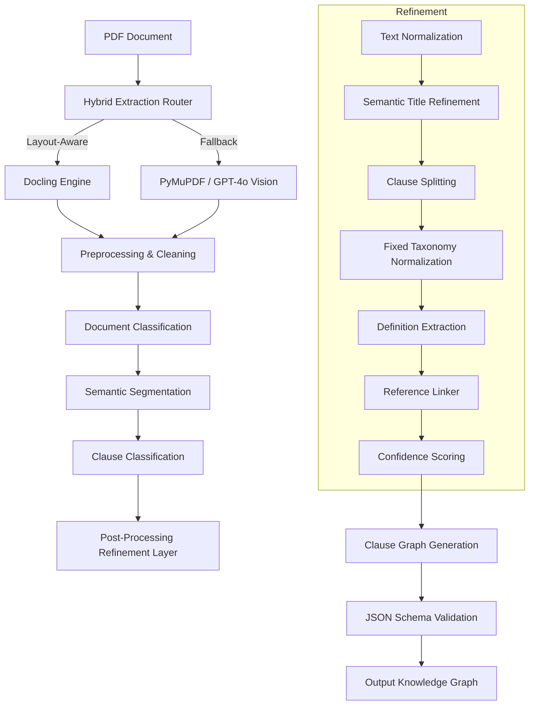

# Advanced Document Intelligence Pipeline (V4)

A production-grade, layout-aware system for extracting, refining, and structuring legal contracts into RAG-ready knowledge graphs.

## Pipeline Architecture

## Key Components

### 1. Hybrid Extraction Engine (Docling)
Replaced traditional OCR with **IBM Docling**, enabling layout-aware extraction of tables, headers, and section hierarchies.
- **Robust Fallback**: Automatically degrades to PyMuPDF or GPT-4o Vision if memory constraints or complex layouts cause Docling failures.

### 2. Zero-Shot Classification
Uses Large Language Models (LLMs) to identify document types and clause categories without hardcoded rules, enabling the system to adapt to any contract type.

### 3. Post-Processing Refinement (New in V4)
A dedicated layer that runs 7 specialized micro-tasks to ensure production-grade quality:
- **Semantic Titles**: Replaces generic headings (e.g., "Section 1") with meaningful titles (e.g., "Non-Compete Boundaries").
- **Overloaded Clause Splitting**: Detects multi-topic clauses and breaks them into granular sub-clauses for better RAG retrieval.
- **Reference Linking**: Extracts cross-references between sections and links them to defined terms.
- **Taxonomy Mapping**: Standardizes fuzzy AI classifications into a 16-point canonical legal taxonomy.

### 4. RAG-Ready Structuring
Final output is a structured JSON graph optimized for Vector Search and Graph RAG:
- **Token-Aware Chunking**: Maintains semantic context while respecting LLM token limits.
- **Metadata Rich**: Includes page numbers, section identifiers, definitions, and confidence scores.

## Performance Optimization
- **Parallel Processing**: Refinement tasks for individual clauses run in parallel to minimize latency.
- **Memory Management**: Docling optimized to run with OCR disabled for standard contracts, preventing mid-flight crashes on large 60+ page files.
